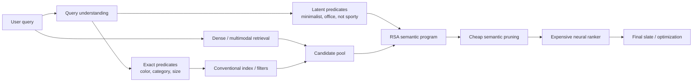
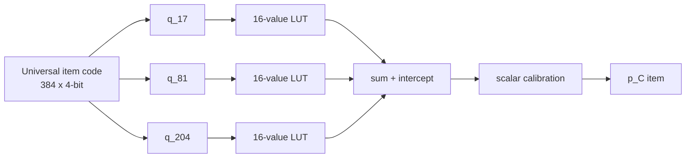
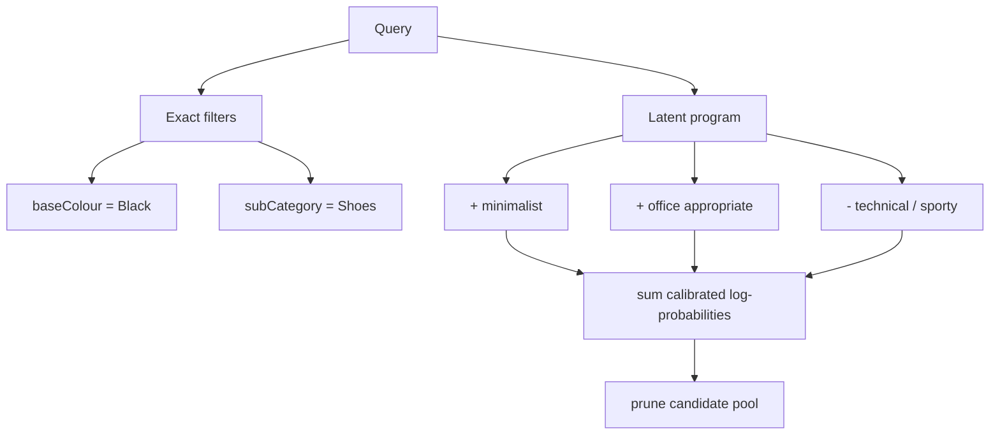
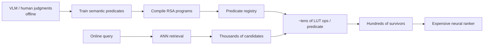

# Random Semantic Algebra: Compiling Latent Semantic Predicates into Low-Bit Programs for Search

**Hani M. M. Al-Shater**  
*Independent research draft — September 2026*

## Abstract

Dense retrieval provides a powerful similarity primitive, while structured search engines provide efficient exact filters. Between them lies a large class of latent semantic constraints—such as *minimalist*, *office-appropriate*, *technical*, *elegant*, or *quiet luxury*—that are useful for search but are neither explicit catalog facets nor naturally expressed by a single vector similarity. We introduce **Random Semantic Algebra (RSA)**, a representation and execution scheme that compiles semantic predicates into small programs over a fixed random quantized item code. Items are mapped once through a random orthogonal rotation and 4-bit quantization. A concept is represented by a sparse set of one-dimensional lookup tables, optionally augmented by a few two-dimensional interaction tables, learned by residual Newton boosting. Independently learned predicates compose through calibrated log-probability addition, enabling conjunction and negation without training a new conjunction representation.

On a 30,000-product mechanism benchmark, a full 4-bit lookup-table compilation matches a full-precision linear classifier (0.9334 versus 0.9331 mean F1), while a sparse 28-coordinate program with four pair interactions reaches about 0.901 mean F1. Calibrated composition raises two-way conjunction F1 from 0.639 for an earlier soft-box baseline to 0.814, and three-way F1 from 0.476 to 0.747. We then run a stricter independent-teacher search pilot: MiniLM title embeddings drive retrieval, CLIP image semantics define eight latent concepts, and RSA learns those concepts only through the MiniLM-side 4-bit code. Across the eight latent predicates RSA achieves 0.689 mean F1 and 0.725 mean average precision on held-out products. For the compound query *minimalist black office shoes not sporty*, retaining 40% of the filtered ANN pool increases relevant-item recall from 0.420 for dense retrieval to 0.652 with RSA, while purity rises from 0.492 to 0.763 at the same downstream candidate budget. These results are preliminary but support a systems hypothesis: **expensive semantic judgments can be compiled offline into reusable, composable, hardware-cheap search predicates.**

---

## 1. Introduction

Modern search systems have two mature computational languages. Dense retrieval expresses semantic similarity: encode a query and an item into vectors and compare them by inner product or cosine similarity. Structured retrieval expresses exact constraints: brand, category, size, color, availability, and other catalog facts can be executed by inverted indexes, bitmaps, or relational predicates.

A growing middle ground is less convenient. Consider:

> **minimalist black office shoes, not sporty**

`black` and `shoes` are straightforward structured facets. `minimalist`, `office-appropriate`, and `not sporty` are latent predicates. A dense query embedding can absorb them into one score, but a single similarity does not naturally preserve conjunction and negation. A VLM or LLM can evaluate the predicates directly, but invoking an expensive model over thousands of candidates places heavy inference in the search loop.

RSA explores a third primitive: **compile semantic concepts once into tiny executable programs over a shared item representation, then compose those programs at query time.** New concepts do not require catalog re-embedding. Runtime execution consists mostly of low-bit coordinate reads, small lookup-table accesses, and additions.

The contributions of this exploratory work are:

1. A fixed 4-bit random semantic substrate that can serve as a shared item code for many independently learned predicates.
2. A sparse predicate compiler based on residual Newton boosting over tiny lookup tables, with optional pair interactions.
3. A calibrated algebra supporting `AND` and `NOT` without conjunction-specific representation training.
4. Evidence that the 4-bit representation itself is not the main accuracy bottleneck: an all-coordinate LUT compilation essentially matches a full-precision linear classifier.
5. An independent-teacher search pilot in which MiniLM retrieves while CLIP image semantics define latent relevance; RSA improves recall and purity at fixed candidate budgets.

RSA is not proposed as a replacement for ANN. The intended role is a **semantic execution layer between broad retrieval and expensive ranking**.

---

## 2. Search architecture



Dense retrieval answers **what is broadly similar?** RSA answers **which retrieved items satisfy this semantic program?** Exact facets remain in the conventional indexing layer.

---

## 3. Fixed random low-bit substrate

Let an item have a normalized embedding

\[
x \in \mathbb{R}^{D}.
\]

Sample one random orthogonal matrix

\[
R \in \mathbb{R}^{D\times D}
\]

and rotate every item once:

\[
z=xR.
\]

Orthogonality preserves inner products and Euclidean geometry before quantization. Each coordinate is then mapped to a 4-bit value

\[
q_j = Q(z_j), \qquad q_j \in \{0,\ldots,15\}.
\]

For the 384-dimensional MiniLM representation used here, the intended packed storage is

\[
384\times4/8 = \mathbf{192\ bytes/item},
\]

versus 1,536 bytes for FP32.

In the first mechanism experiment, original cosine similarity correlated 0.9761 with a 4-bit negative-L1 surrogate and 0.9102 with 1-bit Hamming agreement. These are geometry diagnostics rather than ANN recall guarantees, but they show that aggressive quantization retains substantial structure.

---

## 4. Compiling a semantic predicate

A predicate is represented as a sparse additive program:

\[
F_C(q)=b_C+\sum_{j\in J_C}f_{Cj}(q_j)
       +\sum_{(j,k)\in P_C}g_{Cjk}(q_j,q_k).
\]

Each unary function is only 16 values. An optional pair table is 16×16 values.

### Algorithm 1 — residual-boosted predicate compilation

```text
Input:
    quantized fit codes Q
    binary teacher labels y for concept C
    coordinate budget K
    candidate pool M
    optional pair budget P

1. Initialize score s_i to the class-prior logit.
2. Rank coordinates by a cheap empirical-Bayes / LLR strength and keep M candidates.
3. Repeat K times:
     p_i = sigmoid(s_i)
     g_i = y_i - p_i
     h_i = p_i (1 - p_i)

     For each candidate coordinate j and quantized bin v:
         G_jv = sum_{i: Q_ij=v} g_i
         H_jv = sum_{i: Q_ij=v} h_i

     gain(j) = 0.5 * sum_v G_jv^2 / (H_jv + lambda)

     choose j* with maximum gain
     f_j*(v) = eta * G_j*v / (H_j*v + lambda)
     s_i <- s_i + f_j*(Q_ij*)
     remove j* from the candidate set

4. Optionally perform cyclic Newton backfitting on selected unary tables.
5. Optionally add P pair tables greedily using joint 16x16 bins and the same residual gain.

Output:
    intercept b_C
    selected coordinate IDs
    unary LUTs
    optional pair LUTs
```

The crucial difference from the earlier LLR factor model is **residual optimization**. Later coordinates explain mistakes left by earlier coordinates instead of independently repeating the same evidence.

### Predicate anatomy



The search pilot uses 24 unary tables plus two pair tables per latent concept: roughly **26 LUT operations per concept**.

---

## 5. Calibration and semantic algebra

Independently learned logits are not automatically comparable. For each concept, fit a scalar calibration model on a separate calibration split:

\[
L_C(x)=a_C F_C(q(x))+b_C,
\]

and define

\[
p_C(x)=\sigma(L_C(x)).
\]

For positive predicates \(Q^+\) and negated predicates \(Q^-\), the compound query score is

\[
S_Q(x)=
\sum_{C\in Q^+}\log p_C(x)
+
\sum_{C\in Q^-}\log(1-p_C(x)).
\]

This is a product-of-experts-style ranking rule in probability space. Positive conjunction is associative and commutative, while negation uses the complement probability.

### Algorithm 2 — execute a compound semantic query

```text
Input:
    ANN candidates A
    exact predicates E
    positive latent concepts Q+
    negative latent concepts Q-
    retained candidate budget B

1. A <- apply conventional exact filters E.
2. For every item x in A:
     evaluate each referenced sparse predicate F_C(q(x))
     calibrate to L_C(x)
     score:
       S(x) = sum_{C in Q+} log sigmoid(L_C(x))
            + sum_{C in Q-} log sigmoid(-L_C(x))
3. Keep the B candidates with largest S(x).
4. Pass survivors to the expensive downstream ranker.

Output:
    semantically pruned candidate set
```

The query

> **minimalist black office shoes, not sporty**

becomes:



---

## 6. Mechanism benchmark

### 6.1 Setup

We sample 30,000 products from `ashraq/fashion-product-images-small`. Only `productDisplayName` is embedded with `sentence-transformers/all-MiniLM-L6-v2`; structured fields are used as labels for 14 common concepts. This is a mechanism benchmark, not a leakage-free latent-semantic benchmark, because titles can explicitly contain words such as *Men*, *Black*, or *Shoes*.

### 6.2 Main results

| Method | Substrate | Mean F1 | Mean AP | Sparse? |
|---|---|---:|---:|---|
| Full FP32 linear classifier | FP32 | 0.9331 | 0.9596 | No |
| Compiled linear, all 384 LUTs | 384×4-bit | **0.9334** | **0.9596** | No |
| Residual boosted LUT + 4 pairs | 384×4-bit | **0.9015** | 0.9388 | Yes |
| Residual boosted unary LUT | 384×4-bit | 0.8993 | 0.9372 | Yes |
| Compiled linear, 28 coordinates | 384×4-bit | 0.8619 | 0.9102 | Yes |
| LLR + EB + mRMR | 384×4-bit | 0.8346 | 0.8902 | Yes |
| LLR factor | 384×4-bit | 0.8152 | 0.8724 | Yes |
| Earlier one-sided 4-bit predicate | 384×4-bit | ~0.790 | — | Yes |

The all-coordinate compilation is the diagnostic result: the 4-bit substrate essentially reproduces the FP32 linear decision boundary. The main remaining loss comes from **program sparsification**, not low-bit quantization.

Residual boosting contributes the largest improvement:

\[
0.815 \rightarrow 0.899\;\text{mean F1}.
\]

Pair interactions contribute only about +0.002 F1, suggesting that unary LUTs already capture most of the useful discriminative structure in this benchmark.

### 6.3 Fixed-memory ablations

At the same theoretical 192-byte item budget:

| Substrate | Sparse boosted F1 |
|---|---:|
| 384 × 4-bit | **0.8993** |
| 768 × 2-bit | 0.8894 |
| 1,536 × 1-bit | 0.8630 |

For this task, extra precision is more useful than more random directions.

Power whitening also hurts monotonically: approximately 0.894 at \(\gamma=0.25\), 0.865 at 0.5, 0.799 at 0.75, and 0.688 at full whitening. Semantic anisotropy appears to be signal rather than nuisance for sparse predicate compilation.

---

## 7. Composition benchmark

Earlier hard boxes degraded sharply with query depth:

- two-way literal intersection: 0.590 mean F1;
- two-way soft AND: 0.639;
- three-way literal intersection: 0.476.

Using calibrated RSA predicate scores changes the picture:

| Composition method | Pair F1 | Pair AP | Triple F1 | Triple AP |
|---|---:|---:|---:|---:|
| calibrated log-probability product | **0.814** | **0.852** | 0.746 | **0.780** |
| correlation-weighted log probability | **0.814** | 0.852 | **0.747** | 0.780 |
| soft minimum | 0.814 | 0.850 | 0.745 | 0.778 |
| minimum calibrated logit | 0.814 | 0.848 | 0.743 | 0.774 |
| raw logit addition | 0.715 | 0.755 | 0.563 | 0.586 |

The key result is not a special temperature or correlation correction. It is **calibrate first, then compose in probability space**. Raw logit addition is substantially worse.

---

## 8. Independent-teacher latent search pilot

### 8.1 Why this experiment is stricter

The first latent demo used CLIP both to define latent truth and to retrieve, making the baseline unusually strong and semantically circular. The stricter pilot separates the roles:

- **retrieval / RSA substrate:** MiniLM title embeddings;
- **teacher:** CLIP ViT-B/32 image semantics;
- **latent labels:** derived only from image/prompt similarities;
- **fit / calibration / test:** 4,160 / 1,040 / 2,800 products.

The eight teacher-defined latent concepts are:

`minimalist`, `office_appropriate`, `technical_sporty`, `retro`, `elegant`, `relaxed`, `chunky`, and `quiet_luxury`.

RSA therefore performs a form of cross-modal semantic distillation: expensive visual judgments are compiled into programs that execute only against the MiniLM-derived low-bit item code.

### 8.2 Predicate approximation

| Latent concept | Test F1 | Test AP |
|---|---:|---:|
| quiet luxury | **0.776** | **0.866** |
| elegant | 0.730 | 0.768 |
| minimalist | 0.702 | 0.772 |
| technical / sporty | 0.690 | 0.688 |
| office appropriate | 0.677 | 0.731 |
| relaxed | 0.671 | 0.658 |
| retro | 0.637 | 0.672 |
| chunky | 0.627 | 0.646 |
| **Mean** | **0.689** | **0.725** |

The lower F1 relative to the structured-facet benchmark is expected: RSA is now predicting image-defined semantics from an independent text representation.

### 8.3 Search result at fixed candidate budget

For the query

> **minimalist black office shoes not sporty**

MiniLM retrieves the top 500 test products. Exact `Black` and `Shoes` filters leave 147 candidates, of which 69 satisfy the independent CLIP-derived latent conjunction.

| Fraction retained | Dense recall | RSA recall | Dense purity | RSA purity | Dense hits | RSA hits |
|---:|---:|---:|---:|---:|---:|---:|
| 100% | 1.000 | 1.000 | 0.469 | 0.469 | 69 | 69 |
| 40% | 0.420 | **0.652** | 0.492 | **0.763** | 29 | **45** |
| 20% | 0.246 | **0.333** | 0.586 | **0.793** | 17 | **23** |
| 10% | 0.159 | **0.203** | 0.733 | **0.933** | 11 | **14** |
| 5% | 0.087 | **0.101** | 0.857 | **1.000** | 6 | **7** |

At a 40% candidate budget, RSA retains 45 relevant candidates versus 29 for dense retrieval: **55% more relevant items for identical downstream candidate cost**.

At 10% retention there are only 15 slots for 69 relevant items, so the physical maximum recall is 15/69 = 0.217. RSA obtains 0.203, about 93% of that maximum, with 0.933 purity. At 5% retention all seven RSA survivors are teacher-relevant.

These numbers are from one compound query and must not be generalized as a production effect. Their role is to demonstrate the mechanism under independent retrieval and supervision.

---

## 9. Systems interpretation

A production-oriented architecture could use expensive semantic supervision offline and RSA only online:



Potential uses include:

- latent semantic filters and negative constraints;
- cheap pre-ranking before cross-encoders or large ranking models;
- reusable style, occasion, intent, and quality predicates;
- semantic defect rejection;
- explainable intermediate scores;
- personalization programs composed with query programs.

The production value would come from the **quality–compute Pareto frontier**, not from classification F1 alone. The relevant metrics are final-ranker recall at a candidate budget, NDCG/GMV at fixed latency, and actual packed-kernel throughput.

---

## 10. Limitations

This study remains exploratory.

1. **Single dataset/domain.** Current evidence is fashion-only.
2. **Small latent benchmark.** Eight latent concepts and one detailed compound-query retention sweep are insufficient for general search claims.
3. **Teacher-defined relevance.** CLIP labels are not human fashion judgments.
4. **Representation bottleneck.** Some visual semantics cannot be recovered from title embeddings, placing an upper bound on cross-modal RSA accuracy.
5. **Prototype implementation.** NumPy uint8 arrays are used; 4-bit nibbles are not physically packed and no AVX/NEON/GPU serving kernel is benchmarked.
6. **No production search baseline.** MiniLM is a controlled baseline, not a modern industrial retrieval stack.
7. **Composition thresholding.** F1 composition experiments tune thresholds on conjunction labels; AP is therefore the cleaner zero-shot ranking metric.
8. **Randomness.** The main mechanism results currently rely on a small number of random seeds/rotations.

---

## 11. Next experiments

The next decisive evaluation should contain **50–200 automatically generated compound queries** spanning categories and latent concepts, with independent supervision and repeated seeds. For every query, measure recall/purity/NDCG across candidate retention budgets such as 5%, 10%, 20%, 40%, and 100%, then aggregate the curves with confidence intervals.

Additional priorities:

- human or stronger VLM semantic labels;
- multiple embedding models and multimodal representations;
- K-sweep for 16, 24, 28, 48, 64, 96, 128, 192, 384 LUT operations;
- direct-conjunction ceilings to measure the composition gap;
- ANN Recall@K on the 4-bit substrate;
- packed nibble representation and int8 LUTs;
- AVX2/AVX-512/NEON and GPU kernel benchmarks;
- comparison with sparse linear probes, GAM/EBM-style baselines, small MLP proxies, and direct teacher reranking;
- quality versus latency versus memory Pareto curves.

---

## 12. Conclusion

The strongest version of the original hypothesis—arbitrary semantic concepts become clean hard boxes in a random space—is not supported. A weaker and more useful result emerges.

A fixed low-bit random representation can preserve semantic information surprisingly well. Semantic concepts can be compiled into sparse residual-optimized lookup programs. Once calibrated, independently learned predicates can be composed using a simple probability-space algebra. In a small independent-teacher search pilot, those programs improve the relevant-candidate yield of dense retrieval at the same downstream budget.

The resulting research direction is best summarized as:

\[
\boxed{\text{expensive semantic supervision} \rightarrow \text{compile once} \rightarrow \text{cheap composable search programs}}
\]

If the result survives multi-query evaluation and real systems benchmarks, RSA could become a useful semantic execution primitive between retrieval and expensive ranking.

---

## References

1. Moses Charikar. *Similarity Estimation Techniques from Rounding Algorithms.* STOC, 2002.
2. Jianyang Gao and Cheng Long. *RaBitQ: Quantizing High-Dimensional Vectors with a Theoretical Error Bound for Approximate Nearest Neighbor Search.* arXiv:2405.12497, 2024.
3. Laxman Dhulipala, Majid Hadian, Rajesh Jayaram, Jason Lee, and Vahab Mirrokni. *MUVERA: Multi-Vector Retrieval via Fixed Dimensional Encodings.* NeurIPS, 2024.
4. Alec Radford et al. *Learning Transferable Visual Models From Natural Language Supervision.* ICML, 2021.
5. Nils Reimers and Iryna Gurevych. *Sentence-BERT: Sentence Embeddings using Siamese BERT-Networks.* EMNLP-IJCNLP, 2019.
6. Harsha Nori et al. *InterpretML: A Unified Framework for Machine Learning Interpretability.* 2019. (Related additive-model tooling; RSA uses a custom residual-boosted LUT formulation.)
7. Dataset: `ashraq/fashion-product-images-small`, Hugging Face.
